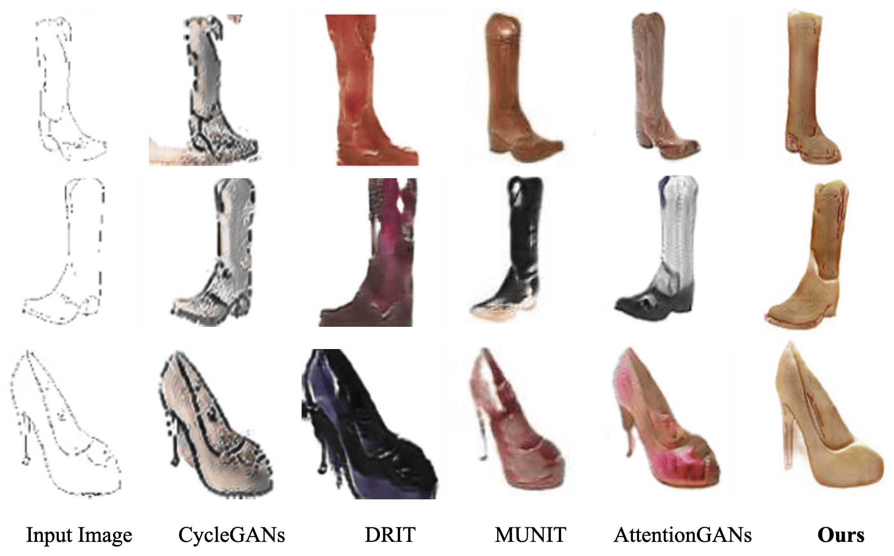
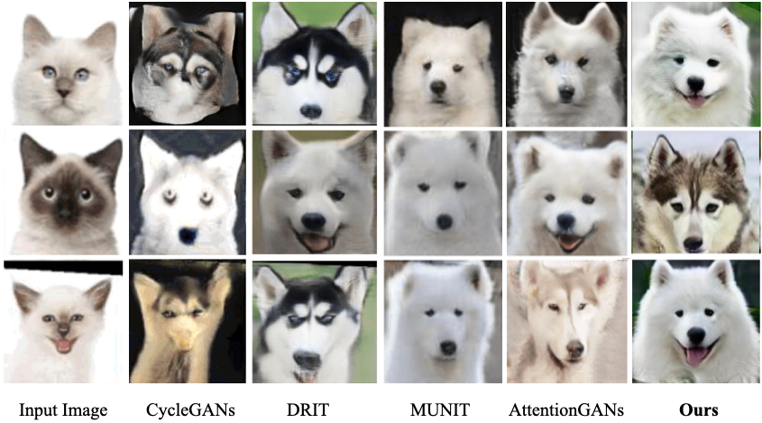
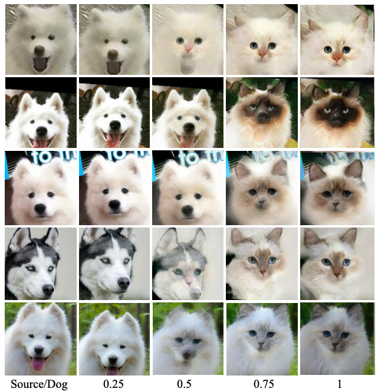
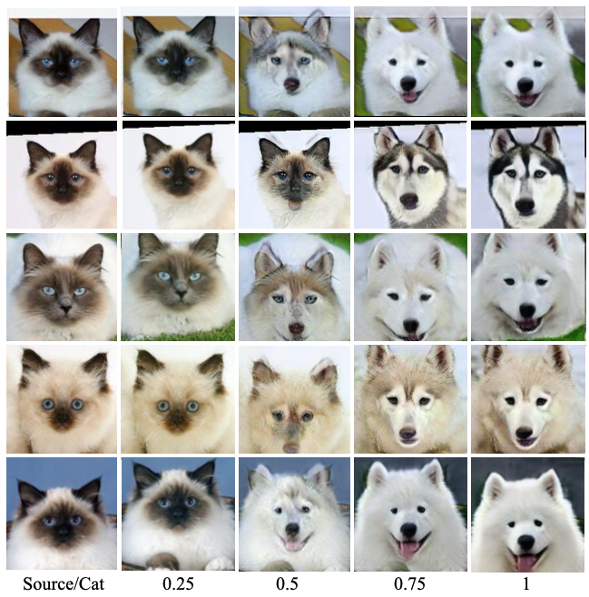

### edge to shoes Translation



### Cat to dog Translation



### Dog to cat interpolation



### Cat to dog interpolation




#### Testing 
```
python test.py
```
 
#### Training
```
python train.py --config configs/edges2handbags.yaml
```

## Reference
Some code are adapted from online.
* [MUNIT](https://github.com/NVlabs/MUNIT)


